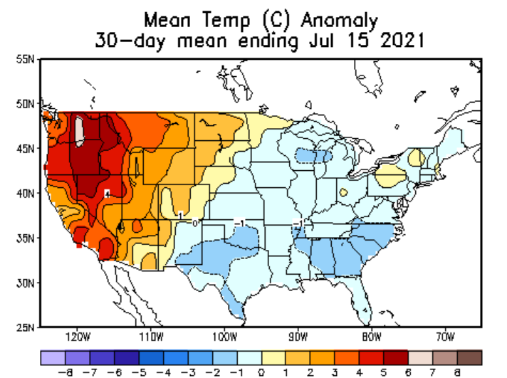

```{r setup, include=FALSE}
knitr::opts_chunk$set(echo = FALSE,
                      fig.pos = "center")
```

## Idea

Exploit the 2021 heatwave on the North American west coast


```{r out.width="250px", fig.cap="Temperature Anomalies in June/July 2021"}

```


## Sick leave data

* [Current Population Survey (CPS)](https://www.census.gov/data/datasets/time-series/demo/cps/cps-basic.html):
  + Available monthly (refers to the week containing the 12th of that month)
  + So the effect (if there is one) should be visible in the July 2021 data
  + Includes state and county information, but county is often missing

* [Small Business Pulse Survey](https://www.census.gov/data/experimental-data-products/small-business-pulse-survey.html):
  + Includes questions about workers' availability to work
  + Weekly data
  + Available by state or by metropolitan area

## Commuting data
* [American Community Survey (ACS)](https://data.census.gov/cedsci/table?q=ACS%20commuting&g=0100000US%240500000&tid=ACSST1Y2019.S0802): Yearly survey including questions about commuting habits

* [Longitudinal Employer-Household Dynamics (LEHD)](https://lehd.ces.census.gov/data/): Includes geographic information on workplace and residency, but only yearly as well

* Maybe fuel consumption could be a good proxy for commuting behavior? That is available monthly from the [EIA](https://www.eia.gov/opendata/qb.php?category=401685), but only for PADD regions

## Crime Data
* Data of all recorded incidents (> 5 Mill.) in a given year is available from the FBI ([here](https://www.icpsr.umich.edu/web/NACJD/series/128?start=0&SERIESQ=128&ARCHIVE=NACJD&PUBLISH_STATUS=PUBLISHED&sort=DATEUPDATED%20desc&rows=50) or [here](https://crime-data-explorer.app.cloud.gov/pages/downloads)):
  + Includes the exact date
  + Includes state and county numbers
  + 2021 is not yet available. But there was another big heatwave in 2016, which could work as well (see [here](https://www.climate.gov/news-features/event-tracker/scorching-heat-bakes-southwest-mid-june-2016))


## Another idea: Data from business tool providers

* The FED St. Louis uses high frequency data from business tool providers (e.g. [here](https://research.stlouisfed.org/publications/review/2021/08/16/assessing-labor-market-conditions-using-high-frequency-data))

* One such provider is [Homebase](https://joinhomebase.com/) and they even have some data on their website. This could include daily data on hours worked or employees working.

* Such tools are mainly used by restaurants & retailers


<!-- ## Crime Identification -->

<!-- \begin{figure} -->
<!-- 	\large{\begin{tikzpicture}[% -->
<!-- 		->, -->
<!-- 		>=stealth, -->
<!-- 		node distance=1cm, -->
<!-- 		pil/.style={ -->
<!-- 			->, -->
<!-- 			thick, -->
<!-- 			shorten =2pt,} -->
<!-- 		] -->
<!-- 		\node (1) {Heat}; -->
<!-- 		\node[right=of 1] (2) {Aggression}; -->
<!-- 		\node[right=of 2] (3) {Crime}; -->
<!-- 		\node[above left = of 3] (4) {X}; -->
<!-- 		\draw [->] (1) to (2); -->
<!-- 		\draw [->] (2) to (3); -->
<!-- 		\draw [->] (4) to (2); -->
<!-- 		\draw [->] (4) to (3); -->
<!-- 	\end{tikzpicture}} -->

<!-- 	\caption{Causal effect of heat on crimes with some confounders X} -->
<!-- \end{figure} -->


