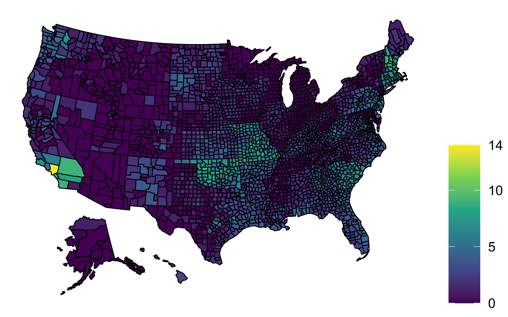
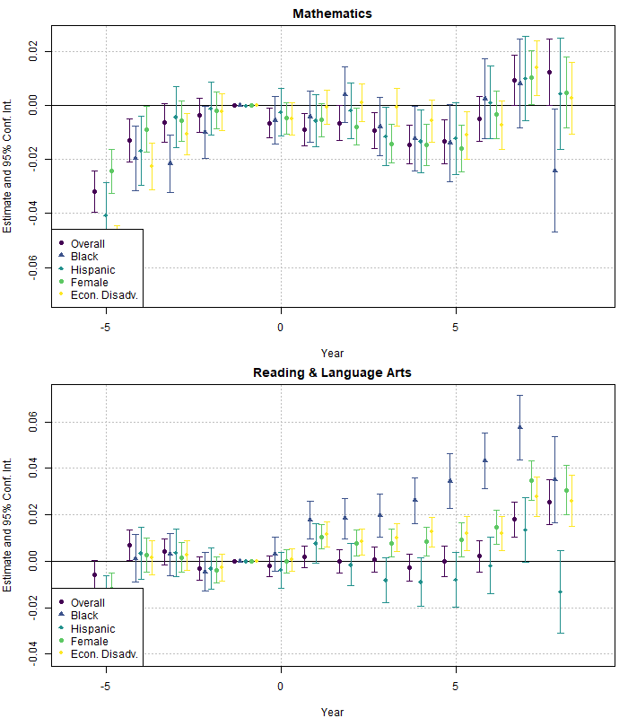

```{r setup, include=FALSE}
knitr::opts_chunk$set(echo = FALSE,
                      warning = FALSE,
                      message = FALSE,
                      fig.pos = "center",
                      fig.width = 8,
                      fig.height = 4)
```


```{r}
# preliminaries
library(data.table)
library(usmap)
library(ggplot2)

dat <- readRDS("Code & Data/Data.RDS")

```


# Natural Disasters and Education

In my thesis I explore the link between natural disasters and education outcomes. The Stanford Education Data Archive [@SEDA] provides standardized test scores by county, year, grade and subject. Data on natural disasters is available at the FEMA database and the **rfema** package [@rfema] provides easy access.

Below you can see the number of cumulative disasters by county from 2008/2009 to 2017/2018.

```{r}


```

The outcomes of interest are mean test scores by county, and achievement gaps between white and black, white and hispanic, male and female, and economically advantaged and disadvantaged students. 

```{r}
dat.summary <- dat[, .("Mean test score" = cs_mn_all,
                       "Mean test score (black students)" = cs_mn_blk,
                       "Mean test score (hispanic students)" = cs_mn_hsp,
                       "Mean test score (female students)" = cs_mn_fem,
                       "Mean test score (economically disadvantaged students)" = cs_mn_ecd)]

vtable::sumtable(dat.summary)
```


To identify a causal effect, I use an event study design. Due to likely very heterogenous treatment effects, I employ the estimator by @Sun_2021. Below you can see a plot of the treatment effects by treatment timing.

```{r}

```

The effect may be more severe for minorities or disadvantaged students. Below you can see the same plot for some subgroups.


```{r}
knitr::include_graphics("Code & Data/ResultsPlotSub.png")
```


## References


