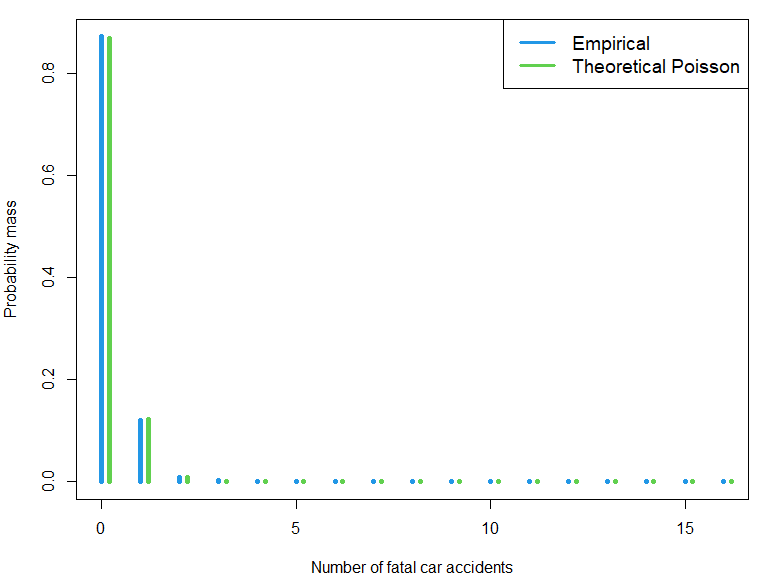

## Extreme Heat Events and Fatal Car Accidents

In my master thesis I want to explore the causal effect of extreme heat
events on fatal car accidents.

<!-- ### Weather Data -->
<!-- Using data provided by the Daily Global Historical Climatology Network [@Menne_2012], I identify extreme heat events in the historical temperature time series. Historical weather data is available for about 1200 measurement stations in the US. Based on the latitude and longitude coordinates I assign each station to the county it belongs to. In case there is more than one station per county, I take the mean among those. -->
<!-- Following the National Climate Data Center (NCDC), I define an extreme heat event as days in which the maximum or minimum temperature exceed the 85th percentile of July and August maximum or minimum temperatures [@Habeeb_2015]. Below you can see the average (across all counties) number of heat days based on minimum and maximum temperatures for each year. -->

### Car Crash Data

Data on fatal car accidents is available from the [Fatality Analysis
Reporting System
(FARS)](https://www.nhtsa.gov/research-data/fatality-analysis-reporting-system-fars).
Below you can see the number of fatal car accidents for each year (on a
national level).

The number of fatal car accidents by day and county seems to closely
follow a poisson distribution (see below). Thus a poisson model seems to
be an attractive option.

