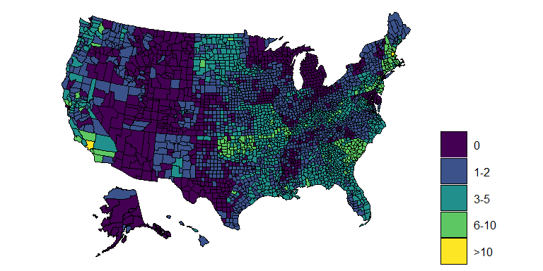

## Extreme Heat Events and Fatal Car Accidents

In my master thesis I want to explore the causal effect of extreme heat
events on fatal car accidents.

### Weather Data

Using data provided by the Daily Global Historical Climatology Network
(Menne et al. 2012), I identify extreme heat events in the historical
temperature time series. Historical weather data is available for about
1200 measurement stations in the US. Based on the latitude and longitude
coordinates I assign each station to the county it belongs to. In case
there is more than one station per county, I take the mean among those.

Following the National Climate Data Center (NCDC), I define an extreme
heat event as days in which the maximum or minimum temperature exceed
the 85th percentile of July and August maximum or minimum temperatures
(Habeeb, Vargo, and Stone 2015). Below you can see the historical daily
maximum temperatures for a few selected counties with such extreme heat
events shaded in red.

| Year | EHE days (maximum temperature) | EHE days (minimum temperature) |
|:-----|-------------------------------:|-------------------------------:|
| 1990 |                      12.514010 |                       7.973913 |
| 1991 |                      12.267892 |                       8.773694 |
| 1992 |                       4.131401 |                       4.137198 |
| 1993 |                       8.946808 |                       7.322050 |
| 1994 |                       7.740812 |                       6.511605 |
| 1995 |                      12.603482 |                      10.923598 |
| 1996 |                       6.924492 |                       6.658277 |
| 1997 |                       6.804453 |                       6.794772 |
| 1998 |                      14.543246 |                      11.976676 |
| 1999 |                      13.629630 |                      11.045809 |
| 2000 |                      11.831867 |                       8.023460 |
| 2001 |                      10.785083 |                      10.615309 |
| 2002 |                      16.126233 |                      11.435897 |
| 2003 |                      10.862376 |                       9.057426 |
| 2004 |                       3.593035 |                       5.761194 |
| 2005 |                      13.016949 |                      11.267198 |
| 2006 |                      14.228686 |                      11.861585 |
| 2007 |                      14.237614 |                      10.694641 |
| 2008 |                       7.308163 |                       6.422449 |
| 2009 |                       6.217526 |                       6.043299 |
| 2010 |                      12.914672 |                      15.094693 |
| 2011 |                      16.861960 |                      14.478398 |
| 2012 |                      18.683136 |                      12.263158 |
| 2013 |                       7.952903 |                      10.145674 |
| 2014 |                       4.816053 |                       7.007804 |
| 2015 |                       9.026077 |                       9.735828 |
| 2016 |                      11.058486 |                      12.292431 |
| 2017 |                       8.372685 |                       8.243056 |
| 2018 |                      10.856124 |                      11.542212 |
| 2019 |                       8.472727 |                       9.463030 |
| 2020 |                      10.792383 |                      11.273956 |

### Car Crash Data

## References

Habeeb, Dana, Jason Vargo, and Brian Stone. 2015. “Rising Heat Wave
Trends in Large US Cities.” *Natural Hazards* 76 (3): 1651–65.
<https://doi.org/10.1007/s11069-014-1563-z>.

Menne, Matthew J., Imke Durre, Bryant Korzeniewski, Shelley McNeill,
Kristy Thomas, Xungang Yin, Steven Anthony, et al. 2012. “Global
Historical Climatology Network - Daily (GHCN-Daily), Version 3.” NOAA
National Centers for Environmental Information.
<https://doi.org/10.7289/V5D21VHZ>.

