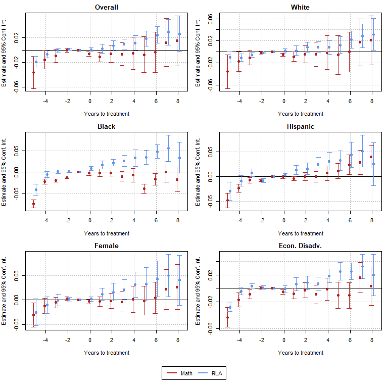

## Extreme Heat Events and Fatal Car Accidents

In my master thesis I want to explore the causal effect of extreme heat
events on fatal car accidents.

### Weather Data

Using data provided by the Daily Global Historical Climatology Network
(Menne et al. 2012), I identify extreme heat events in the historical
temperature time series. Historical weather data is available for about
1200 measurement stations in the US. Based on the latitude and longitude
coordinates I assign each station to the county it belongs to. In case
there is more than one station per county, I take the mean among those.

Following the National Climate Data Center (NCDC), I define an extreme
heat event as days in which the maximum or minimum temperature exceed
the 85th percentile of July and August maximum or minimum temperatures
(Habeeb, Vargo, and Stone 2015). Below you can see the average (across
all counties) number of heat days based on minimum and maximum
temperatures for each year.

### Car Crash Data

Data on fatal car accidents is available from the [Fatality Analysis
Reporting System
(FARS)](https://www.nhtsa.gov/research-data/fatality-analysis-reporting-system-fars).
Below you can see the number of fatal car accidents for each year (on a
national level).

### Causal Effect?

A naive point estimate of the average treatment effect using the
difference of conditional means (conditional on treatment) indicates
positive causal effects, that is extreme heat increases the number of
fatal car accidents.

|                    |       ATE |
|:-------------------|----------:|
| MaximumTemperature | 0.0074828 |
| MinimumTemperature | 0.0057406 |

However, this estimator is only useful if there is no selection bias and
if treatment effects are homogenous, which is unlikely. Therefore, my
next step will be working on a credible identification strategy.

## References

Habeeb, Dana, Jason Vargo, and Brian Stone. 2015. “Rising Heat Wave
Trends in Large US Cities.” *Natural Hazards* 76 (3): 1651–65.
<https://doi.org/10.1007/s11069-014-1563-z>.

Menne, Matthew J., Imke Durre, Bryant Korzeniewski, Shelley McNeill,
Kristy Thomas, Xungang Yin, Steven Anthony, et al. 2012. “Global
Historical Climatology Network - Daily (GHCN-Daily), Version 3.” NOAA
National Centers for Environmental Information.
<https://doi.org/10.7289/V5D21VHZ>.

